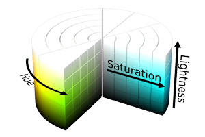
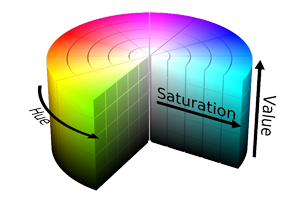
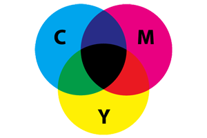

Chroma Documentation
====================

Chroma is a Python module for handling colors with ease.

Manipulating colors can quickily escalate into a tedious and complicated task, particularly when you become concerned with color systems beyond RGB. Chroma is here to provide a simple API to do the heavy lifting, so that you can stay focused on the important parts of your projects.

Before you ask, Chroma is BSD licensed, available on `Github <https://github.com/seenaburns/Chroma>`_ and PyPI.

Features
--------
- :ref:`basic`
- Color Systems: :ref:`RGB <rgb>`, :ref:`HEX <hex>`, :ref:`HLS <hls>`, :ref:`HSV<hsv>`, :ref:`CMY and CMYK<cmyk>`
- :ref:`alpha`
- :ref:`blending`

Quickstart
----------

Getting started with the power of Chroma is meant to be straightfoward:

::

    import chroma

    # Create a color object
    color = chroma.Color('#00FF00')

    # Handling different color systems
    color.cmy = (0.3, 0.7, 0.8)
    color.rgb    # (0.7, 0.3, 0.2)
    color.hls    # (0.0333, 0.45, 0.5556)

    # Alpha
    color.alpha = 0.5
    color.hsv    # (0.03333, 0.7143, 0.7, 0.5)

    # Color blending
    color + chroma.Color("#FF00FF")
    # #FF4DFF

And there you have it. The rest of this document describes Chroma's functionality and usage in detail.

Installation
------------

Installation is as easy as:

::

    pip install chroma

Or if you're an easy_install-er:

::

    easy_install chroma

Chroma does not yet support Python 3, but, if you're interested, see :ref:`contribute`

.. _basic:

Basic Color Tasks
-----------------

At Chroma's core is the Color object. To create a color object, use the constuctor, which accepts any of the available color systems:

.. function:: chroma.Color([color_value = '#FFFFFF'[, format = 'HEX']])

For example, to create a red Color object:

::

    red = chroma.Color((1, 0, 0), 'RGB')
    red
    # #FF0000

Color objects can be compared with each other too.

::

    red != chroma.Color('#00FF00')
    # True

Manipulating Color objects can be easily achieved by using its properties. Every color system has a getter and setter for operating with that system.

::

    red.hls = (10, 0.3, 0.9)
    red.rgb256
    # (145, 8, 8)

Color Systems
-------------

Working with multiple color systems can be done using the getter and setter properties for each system.

Interally, colors are stored in rgb float format.

.. _rgb:

RGB - Red, Blue, Green
----------------------

.. image:: _static/rgb.png

Chroma provides properties for RGB in both float and 256 tuple format. Color.rgb outputs float coordinates, ranging from 0 to 1, where 1 is white. Color.rgb256 outputs integer coordinates ranging from 0 to 255, where 255 is white.

RGB is used for :ref:`Additive mixing <additive>`.

If :ref:`Alpha` is active, alpha (float) will be appended to both rgb and rgb256. Likewise appending alpha to rgb and rgb256 setters will activate alpha on the color.

.. function:: chroma.Color.rgb
.. function:: chroma.Color.rgb(color_tuple)

.. function:: chroma.Color.rgb256
.. function:: chroma.Color.rgb256(color_tuple)

.. _hex:

HEX - #rrggbb
-------------

For convenience, a hexadecimal setter and getter are also provided, though hex representation is just a wrapper for RGB. The hexadecimal setter accepts a string in the format ('#RRGGBB'). Currently, Chroma does not support other hexadecimal representations.

As with the other RGB representations, alpha will be appended to the output if the alpha channel is active.

.. function:: chroma.Color.hex
.. function:: chroma.Color.hex(hex_string)

.. _hls:

HLS - Hue, Saturation, Lightness
--------------------------------

HLS (also known as HSL) is in the format (Hue °, Saturation %, Lightness %). Which means hue has a range of 0 - 360, while saturation and lightness have a range of 0 - 1.

As with RGB, Alpha will be appended if active.

.. function:: chroma.Color.hls
.. function:: chroma.Color.hls(color_tuple)

.. _hsv:

HSV - Hue, Saturation, Value
----------------------------

Like HLS, HSV comes in the format (Hue °, Saturation %, Lightness %), so hue has a range of 0 - 360, but saturation and value have a range of 0 - 1.

**NOTE:** HSV saturation and HLS saturation are **NOT** the same:

    "Under HSV model, adding white to a pure color reduces its saturation, while adding black to a pure color reduces it's value. Under the [HLS] model, adding white or black to a pure color simply moves you up and down the brightness axis, and only by adding combinations of white AND black can you alter the color's saturation."

As with RGB, Alpha will be appended if active.

.. function:: chroma.Color.hsv
.. function:: chroma.Color.hsv(color_tuple)

.. _cmyk:

CMY and CMYK - Cyan, Magenta, Yellow (and Black)
------------------------------------------------

Chroma supports both CMY and CMYK input and output. CMY and CMYK are both in floating point form, ranging from 0 - 1, but are subtractive color models. This means, (1, 1, 1) represents black (not white) in CMY.

Unlike RGB, alpha will not be appened.

.. function:: chroma.Color.cmy
.. function:: chroma.Color.cmy(color_tuple)

.. function:: chroma.Color.cmyk
.. function:: chroma.Color.cmyk(color_tuple)

.. _alpha:

Alpha
-----

Chroma supports an alpha channel, but it is unset by default. To activate alpha, you can pass in a color system with alpha appended (only RGB, RGB256, HEX, HLS, HSV) or set it using the property. Alpha ranges from 0 - 1 in floating point representation.

To turn off alpha, set it's value to None.

.. function:: chroma.Color.alpha
.. function:: chroma.Color.alpha(value)

.. _blending:

Blending (Additive and Subtractive Mixing)
------------------------------------------

.. _additive:

Additive (Light) Mixing
-----------------------

.. _subtractive:

Subtractive (Dye) Mixing
------------------------

.. _contribute:

Contribute
----------
Chroma is under active development and could use your support. Even bug reports, feature suggestions and feedback can help push Chroma forward in the right direction.

Chroma is hosted on `Github <https://github.com/seenaburns/Chroma>`_ and there are a number of ideas of where to start in the `issues section <https://github.com/seenaburns/Chroma/issues>`_.
