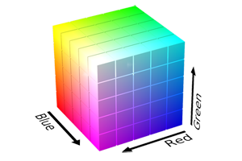

Chroma Documentation
====================

Chroma is a Python module for handling colors with ease.

Manipulating colors can quickily escalate into a tedious and complicated task, particularly when you become concerned with color systems beyond RGB. Chroma is here to provide a simple API to do the heavy lifting, so that you can stay focused on the important parts of your projects.

Before you ask, Chroma is BSD licensed, available on `Github <https://github.com/seenaburns/Chroma>`_ and PyPI.

Features
--------
- :ref:`basic`
- Color Systems: :ref:`RGB <rgb>`, :ref:`HEX <hex>`, :ref:`HLS <hls>`, :ref:`HSV<hsv>`, :ref:`CMY and CMYK<cmyk>`
- :ref:`alpha`
- :ref:`blending`

Quickstart
----------

Getting started with the power of Chroma is meant to be straightfoward:

::

    import chroma

    # Create a color object
    color = chroma.Color('#00FF00')

    # Handling different color systems
    color.cmy = (0.3, 0.7, 0.8)
    color.rgb    # (0.7, 0.3, 0.2)
    color.hls    # (0.0333, 0.45, 0.5556)

    # Alpha
    color.alpha = 0.5
    color.hsv    # (0.03333, 0.7143, 0.7, 0.5)

    # Color blending
    color + chroma.Color("#FF00FF")
    # #FF4DFF

And there you have it. The rest of this document describes Chroma's functionality and usage in detail.

Installation
------------

Installation is as easy as:

::

    pip install chroma

Or if you're an easy_install-er:

::

    easy_install chroma

Chroma does not yet support Python 3, but, if you're interested, see :ref:`contribute`

.. _basic:

Basic Color Tasks
-----------------

At Chroma's core is the Color object. To create a color object, use the constuctor, which accepts any of the available color systems:

.. function:: chroma.Color([color_value = '#FFFFFF'[, format = 'HEX']])

For example, to create a red Color object:

::

    red = chroma.Color((1, 0, 0), 'RGB')
    red
    # #FF0000

Color objects can be compared with each other too.

::

    red != chroma.Color('#00FF00')
    # True

Manipulating Color objects can be easily achieved by using its properties. Every color system has a getter and setter for operating with that system.

::

    red.hls = (10, 0.3, 0.9)
    red.rgb256
    # (145, 8, 8)

Color Systems
-------------

Working with multiple color systems can be done using the getter and setter properties for each system.

Interally, colors are stored in rgb float format.

.. _rgb:

RGB - Red, Blue, Green
----------------------

RGB (Red, Blue, Green) is very common color representation in digital systems.

Chroma provides properties for RGB in both float and 256 tuple format. Color.rgb outputs float coordinates, ranging from 0 to 1, where 1 is white. Color.rgb256 outputs integer coordinates ranging from 0 to 255, where 255 is white.

If :ref:`Alpha` is active, rgb and rgb256 will output a 4th coordinate in floating point representation.

.. function:: chroma.Color.rgb
.. function:: chroma.Color.rgb(color_tuple)

.. function:: chroma.Color.rgb256
.. function:: chroma.Color.rgb256(color_tuple)

.. _hex:

HEX - #rrggbb
-------------

.. _hls:

HLS - Hue, Saturation, Lightness
--------------------------------

.. _hsv:

HSV - Hue, Saturation, Value
----------------------------

.. _cmyk:

CMY and CMYK - Cyan, Magenta, Yellow (and Black)
------------------------------------------------

.. _alpha:

Alpha
-----

.. _blending:

Blending (Additive and Subtractive Mixing)
------------------------------------------

.. _contribute:

Contribute
----------
Chroma is under active development and could use your support. Even bug reports, feature suggestions and feedback can help push Chroma forward in the right direction.

Chroma is hosted on `Github <https://github.com/seenaburns/Chroma>`_ and there are a number of ideas of where to start in the `issues section <https://github.com/seenaburns/Chroma/issues>`_.
